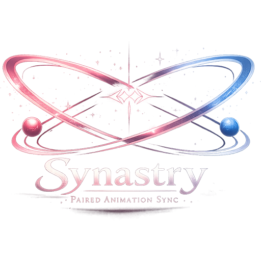

# Synastry



Synastry is a Dalamud plugin for finding, organizing, sharing, and playing Penumbra animation mods.

It turns large animation collections into a practical launcher: browse mods, organize them into folders, collapse large option groups, label multi-actor roles, and activate animations without manually changing Penumbra settings.

## Community role labels

Multi-actor animation packs are often difficult to understand when their options are only named `Ground Sit 1`, `Ground Sit 2`, and so on. Synastry lets those activation buttons carry useful role names such as `Driver`, `Passenger`, `Top`, or `Bottom`.

Role labels are community-driven:

- Right-click an activation button to create or edit its label.
- Existing local labels are always respected and never overwritten.
- Non-private labels can be shared with other members of a room.
- Accepted community labels are available to anyone connected to Synastry.
- If a shared label is wrong, right-click it and submit a correction.
- Your correction applies locally immediately.
- The first submitted label becomes the community default immediately.
- Five matching installation reports replace an existing community label.
- Private mods never submit labels to the community database.

The goal is simple: once the community identifies the roles in a complicated animation pack, everyone else can use it without solving the same puzzle again.

## Mod sharing

If another room member does not have an animation, Synastry can offer the mod directly through the room. The recipient explicitly accepts or declines the transfer, and accepted packages are handed to Penumbra for installation.

This makes coordinated animation sessions much easier: find an animation, share it with the people who need it, assign the roles, and start together from the same room.

- Transfers are limited to 75 MB.
- Transfer packages expire from relay storage after 10 minutes.
- Private mods cannot be advertised or sent.
- Mods are never transferred without the recipient accepting the offer.

## Other features

- Automatically lists Penumbra mods containing animation files.
- Collapsible option groups support large packs with hundreds of choices.
- Create folders and drag mods into a preferred order.
- Mark mods private from their right-click menu.
- Temporarily activate animations without disturbing unrelated Penumbra settings.
- Ready a room for synchronized playback or play an animation locally with **Solo**.
- Right-click another player to send a room invitation they can accept or decline immediately.
- Align your character with a nearby target before playback.
- Optionally enable **Sit/doze anywhere** for furniture-free chair-sit and doze animations.
- Green, orange, purple, cyan, and white indicators show room availability, suggestions, and privacy state.

## Install

Add this URL under **Dalamud Settings → Experimental → Custom Plugin Repositories**:

```text
https://aethercast.org/repo
```

This combined repository contains **AetherPress** and **Synastry**. Save the
settings, open the Plugin Installer, and search for **Synastry**.

Use `/synastry` to open the plugin. To join a room directly, use:

```text
/synastry join ROOMCODE
```

## Privacy

Room matching uses animation fingerprints instead of local file paths. Community labels are keyed by opaque mod fingerprints and animation trigger IDs. The community database does not require character names, mod names, or local paths.

Private mods are excluded from room catalogs, transfers, and community-label submissions.

## Build

Building the plugin requires the Dalamud development environment:

```powershell
dotnet build EmoteLink.slnx -c Release
```

The relay source and deployment notes are in `EmoteLink.Relay`.

Synastry is licensed under AGPL-3.0-or-later.
